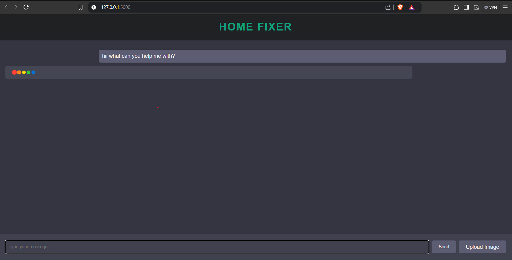

# Home Improvement Assistant

## Overview

The Home Improvement Assistant is a Flask-based web application designed to assist users with home improvement, repair, and maintenance queries. The application integrates multiple technologies to provide intelligent responses based on text extracted from PDFs and images. Key components include:

- **Text Extraction from PDFs**: Extracts text from PDF documents and stores it in a ChromaDB collection.
- **Text Embeddings and Retrieval**: Uses sentence transformers to create text embeddings and retrieve relevant information.
- **Image Analysis**: Utilizes the CLIP model to classify uploaded images.
- **OpenAI Integration**: Provides context-aware responses using OpenAI's GPT-4 model.

## Features

- Extract text from PDF files and store it in a ChromaDB collection.
- Analyze and classify images using CLIP.
- Generate context-aware responses to user queries using GPT-4.
- Interactive web interface for user interaction.

## Technologies Used

- **Python Libraries**:
  - `PyMuPDF` for PDF text extraction
  - `chromadb` for database management
  - `sentence_transformers` for text embedding
  - `openai` for GPT-4 integration
  - `transformers` and `PIL` for image analysis
  - `flask` for web framework
  - `torch` for machine learning operations
- **ChromaDB**: Vector database for managing text embeddings
- **CLIP**: Model for image-text classification

## Installation

### Prerequisites

- Python 3.8+
- Pip

### Setup

1. **Clone the Repository**

   ```bash
   git clone https://github.com/yourusername/home-improvement-assistant.git
   cd home-improvement-assistant
   ```

2. **Create a Virtual Environment**

   ```bash
   python -m venv venv
   source venv/bin/activate  # On Windows use `venv\Scripts\activate`
   ```

3. **Install Dependencies**

   ```bash
   pip install -r requirements.txt
   ```

4. **Setup Environment Variables**

   Create a `.env` file in the root directory and add your OpenAI API key:

   ```
   OPENAI_API_KEY=your_openai_api_key
   ```

5. **Prepare ChromaDB Directory**

   Ensure that the ChromaDB data directory exists:

   ```bash
   mkdir chromadb_data
   ```

6. **Run the Application**

   ```bash
   python app.py
   ```

## Usage

1. **Access the Web Interface**

   Open your web browser and navigate to `http://127.0.0.1:5000/`.

2. **Upload PDF and Extract Text**

   - Place your PDF files in the specified directory.
   - The application will automatically extract text from the PDF and store it in the ChromaDB collection.

3. **Ask Questions**

   - Enter your queries in the web interface.
   - Optionally, upload images to get additional context-based responses.

4. **View Results**

   - The application will return answers based on the extracted text and image analysis.

## Demonstration

### Videos

<!-- Add demonstration video links here -->
- [Video 1: Overview of the Home Improvement Assistant](content/demo1.mp4)

### Photos

<!-- Add demonstration photos here -->



## Code Explanation

### Text Extraction from PDFs

- `extract_text_from_pdf(pdf_path)`: Opens the PDF and extracts text from each page.
- `save_text_to_file(text, file_path)`: Saves the extracted text to a file.

### ChromaDB Integration

- Initializes the ChromaDB client and creates a collection for storing text embeddings.
- `chunk_text(text, chunk_size)`: Splits the text into chunks for embedding.
- `add_text_to_chroma(collection, text, chunk_size)`: Adds text chunks to ChromaDB.

### Image Analysis

- `process_image_with_clip(file_path)`: Processes an image to classify its content using the CLIP model.

### Query Response Generation

- `get_rag_response(user_query, conversation_history, image_context)`: Generates a response based on user query, conversation history, and image context using GPT-4.

### Flask Application

- `index()`: Renders the main page of the web application.
- `ask()`: Handles user queries and image uploads.
- `uploaded_file(filename)`: Serves uploaded files.

## Contributing

Feel free to open issues or submit pull requests to contribute to this project. Please ensure your changes are well-documented and tested.

## License

This project is licensed under the MIT License. See the [LICENSE](LICENSE) file for details.

## Acknowledgements

- **OpenAI** for providing GPT-4
- **Hugging Face** for the CLIP model
- **PyMuPDF**, **SentenceTransformers**, and other libraries used in this project
```

You can replace the placeholders for demonstration videos and photos with actual URLs or file paths once you have them. Additionally, you can update the repository URL and other specific details to match your project's requirements.
